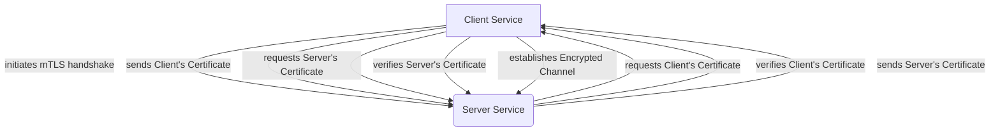

In the dynamic world of modern application development, microservices have become the de-facto standard, offering unparalleled agility and scalability. But here's the burning question: Are your distributed applications truly secure against the ever-evolving threat landscape? 🔐

---

## Introduction

As organizations sprint towards cloud-native architectures, the shift from monolithic applications to interconnected microservices introduces a new frontier of security challenges. Each service, while independent, becomes a potential entry point for attackers if not properly fortified. This isn't just a theoretical concern; reports from Akamai and Gartner indicate a significant increase in API-related breaches and supply chain attacks targeting distributed systems in 2024-2025. Protecting these intricate systems isn't just about firewalls anymore; it's about embedding security deep within the architecture itself.

In this deep dive, we'll equip you with the knowledge to safeguard your microservices by exploring three critical pillars: **Service Mesh Security**, **Mutual TLS (mTLS)**, and **API Gateway Controls**. You'll learn not only *what* they are but *how* to implement them for a robust, future-proof security posture, leveraging the latest trends and tools. Are you ready to transform your microservices from a security headache into a fortress? 🛡️

---

## The Microservices Security Challenge: A Distributed Dilemma

Imagine a bustling city where every building (a microservice) is an independent business. While efficient, securing this city is far more complex than securing a single, giant skyscraper. Traditional perimeter-based security struggles in this environment, as traffic often flows *between* services *within* the network, bypassing edge defenses entirely. This "east-west" traffic is a prime target for lateral movement attacks, where an attacker, having breached one service, can easily pivot to others.

The rise of containerization and orchestration platforms like Kubernetes has further accelerated microservices adoption, but also amplified the complexity. Identity management, authorization, encryption in transit, and observability for thousands of interconnected services can quickly become unmanageable. The 2024 "Cloud Native Security Survey" highlighted that over 60% of organizations struggle with consistent security policies across their microservices, leading to critical vulnerabilities.

> **Key Takeaway:** The distributed nature of microservices renders traditional perimeter security inadequate; internal "east-west" traffic and consistent policy enforcement are the new battlegrounds.

---

## Service Mesh: The Invisible Security Layer

Enter the **Service Mesh** – a dedicated infrastructure layer that handles service-to-service communication. Think of it as the city's sophisticated traffic control system and integrated security patrol. It decouples security concerns from application code, providing capabilities like traffic management, observability, and critically, security features right out of the box. Popular service meshes like Istio, Linkerd, and Consul Connect are leading this charge.

A service mesh operates by injecting a proxy (often Envoy) alongside each service instance. These proxies intercept all incoming and outgoing network traffic for their respective services, allowing the mesh to enforce policies, encrypt communications, and collect telemetry without requiring changes to the application code itself. This "sidecar" model makes security ubiquitous and consistent.

{: .prompt-info}
> **Did you know?** The latest iterations of service meshes, like Istio Ambient Mesh, are exploring "proxyless" architectures for certain functionalities, aiming to reduce resource overhead while maintaining security benefits. This is a key trend to watch in 2025-2026.

Here’s how a service mesh bolsters security:

*   **Policy Enforcement:** Define granular authorization policies (who can talk to whom and under what conditions).
*   **Traffic Encryption (mTLS):** Automatically encrypts all service-to-service communication.
*   **Identity Management:** Provides strong cryptographic identities to each service.
*   **Observability:** Logs all traffic, providing a detailed audit trail and detecting anomalies.

Imagine setting a policy where only the `order-processing` service can communicate with the `payment-gateway` service, and only via a specific port. Here's a simplified Istio authorization policy example:

```yaml
apiVersion: security.istio.io/v1beta1
kind: AuthorizationPolicy
metadata:
  name: payment-access
  namespace: default
spec:
  selector:
    matchLabels:
      app: payment-gateway # Target the payment-gateway service
  action: ALLOW
  rules:
  - from:
    - source:
        principals: ["cluster.local/ns/default/sa/order-processing"] # Only allow order-processing service account
    to:
    - operation:
        methods: ["POST"] # Only allow POST requests
        ports: ["8080"] # Only allow traffic on port 8080
```

{: .prompt-tip}
> **Pro Tip:** When deploying a service mesh, start with a minimal set of security policies and gradually harden them. Overly restrictive policies from the start can cause unexpected service disruptions.

---

## mTLS: Zero Trust at the Core

If the service mesh is the security patrol, then **Mutual TLS (mTLS)** is the mandatory ID check and secure handshake for every interaction. In a traditional TLS handshake, only the client authenticates the server. With mTLS, *both* the client and the server verify each other's identities using digital certificates before establishing a secure, encrypted connection. This is fundamental to a Zero Trust architecture, where no entity is trusted by default, regardless of its network location.

Why is mTLS critical for microservices?

1.  **Strong Authentication:** Guarantees that only legitimate services can communicate, preventing unauthorized access and impersonation.
2.  **Encryption in Transit:** All data exchanged between services is encrypted, protecting against eavesdropping and data tampering.
3.  **Preventing Lateral Movement:** If an attacker compromises one service, they cannot easily move to another without a valid mTLS certificate.
4.  **Compliance:** Helps meet regulatory requirements for data encryption and access control.

Most service meshes automate mTLS provisioning and rotation. The service mesh's Certificate Authority (CA) issues short-lived certificates to each service, making key management scalable and robust.



{: .prompt-warning}
> **Security Warning:** While mTLS provides strong authentication and encryption, it's crucial to ensure your CA is secure and certificate revocation mechanisms are in place. Compromised CAs can undermine your entire mTLS infrastructure. Regularly audit your certificate lifecycle management.

---

## API Gateways: The First Line of Defense

While a service mesh secures *internal* service-to-service communication, the **API Gateway** stands at the perimeter, protecting *external* traffic entering your microservices architecture. It's the secure front door to your city, controlling who gets in and what they can access. API Gateways like Kong, Apigee, and AWS API Gateway provide a centralized point for managing, securing, and routing external API requests.

An API Gateway offers several layers of defense:

*   **Authentication & Authorization:** Verifies external client identities (e.g., OAuth2, JWT) and enforces access policies before requests even reach your services.
*   **Rate Limiting & Throttling:** Protects against DDoS attacks and abuse by limiting the number of requests a client can make within a given period.
*   **Input Validation:** Filters malicious inputs, preventing injection attacks (SQLi, XSS) before they hit your backend services.
*   **Traffic Routing:** Routes requests to the appropriate backend service, abstracting the microservices' internal structure from external consumers.
*   **Protocol Translation:** Can translate various external protocols to the internal protocols used by your microservices.
*   **Caching:** Improves performance and reduces load on backend services.

{: .prompt-danger}
> **Critical Security Issue:** A misconfigured API Gateway can expose your entire microservices backend. In 2024, several high-profile data breaches stemmed from poorly secured API endpoints, highlighting the critical need for rigorous configuration and continuous auditing of API Gateways. Always follow the principle of least privilege.

Example of an API Gateway configuration (pseudo-YAML, inspired by Kong/Ambassador):

```yaml
apiVersion: gateway.networking.k8s.io/v1beta1
kind: HTTPRoute
metadata:
  name: public-api-route
spec:
  parentRefs:
  - name: my-api-gateway
  hostnames:
  - "api.obsqura.com"
  rules:
  - matches:
    - path:
        type: Prefix
        value: /users
    filters:
    - type: RequestHeader
      requestHeader:
        add:
          X-Auth-Verified: "true" # Example: Add header after JWT verification
    - type: RequestRateLimit
      requestRateLimit:
        rules:
        - limit: 100
          period: 60s
          burst: 20
    backendRefs:
    - name: user-service
      port: 80
```

---

## Integrating for Comprehensive Protection

The true power lies in integrating these security layers into a cohesive strategy. While API Gateways protect the perimeter, and service meshes secure the interior, they are complementary, not mutually exclusive.

**How they work together:**

*   **External Access (API Gateway):** All external requests first hit the API Gateway, which handles initial authentication, authorization, rate limiting, and input validation.
*   **Internal Routing (API Gateway to Service Mesh):** Once validated, the API Gateway routes the request to the appropriate internal service *within the service mesh*.
*   **Internal Communication (Service Mesh):** As the request traverses through various microservices, the service mesh ensures all internal communication is encrypted with mTLS and adheres to granular authorization policies.

This layered defense creates a robust security posture, adhering to the Zero Trust principle by verifying every request, internal or external.

| Feature            | API Gateway           | Service Mesh         |
| :----------------- | :-------------------- | :------------------- |
| **Scope**          | North-South (external) | East-West (internal) |
| **Primary Focus**  | Edge Security, API Management, External Access | Service-to-Service Communication, Internal Policy, Observability |
| **Key Mechanisms** | AuthN/AuthZ (external), Rate Limiting, Input Validation, Caching | mTLS, Fine-grained AuthN/AuthZ (internal), Traffic Routing, Circuit Breaking |
| **Deployment**     | Usually at cluster edge/ingress | Sidecar proxy with each service |
| **Typical Tools**  | Kong, Apigee, AWS API Gateway, Azure API Management | Istio, Linkerd, Consul Connect |

{: .prompt-info}
> **Current Trend:** Many organizations are now implementing "Layer 7 Load Balancers" or "Kubernetes Ingress Controllers" that incorporate some API Gateway functionalities, effectively bridging the gap between external and internal security concerns within a single platform. Tools like Nginx Ingress or Envoy Gateway are evolving rapidly in this space.

---

## Key Takeaways

*   **Embrace Zero Trust:** Never trust, always verify. Implement mTLS for all service-to-service communication to enforce identity and encryption at the core.
*   **Layered Defense is Key:** Combine external protection (API Gateway) with internal security (Service Mesh) for comprehensive coverage against diverse threats.
*   **Automate Security:** Leverage service meshes to automate mTLS, policy enforcement, and observability, reducing manual overhead and human error.
*   **Prioritize API Security:** Your API Gateway is the front line. Rigorously configure authentication, authorization, rate limiting, and input validation. Regularly audit your API endpoints.
*   **Stay Updated:** The microservices ecosystem evolves rapidly. Keep abreast of the latest developments in service mesh (e.g., Istio Ambient Mesh) and API Gateway technologies.

---

## Conclusion

Securing modern microservices architectures is a complex, yet conquerable, challenge. By strategically deploying and integrating service meshes, implementing mTLS, and fortifying your API gateways, you're not just adding security features; you're building a resilient, zero-trust foundation for your distributed applications. This layered approach not only protects your valuable data and services from sophisticated attacks but also provides the visibility and control needed to operate confidently in the cloud-native era.

Don't let your innovative microservices become security vulnerabilities. Invest in these critical protections today and ensure your distributed city thrives securely.

What's the next step you'll take to harden your microservices? Share your thoughts below!

**—Mr. Xploit** 🛡️